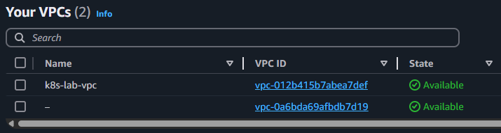
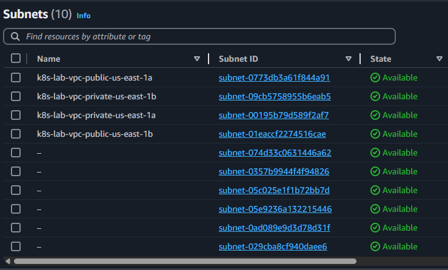
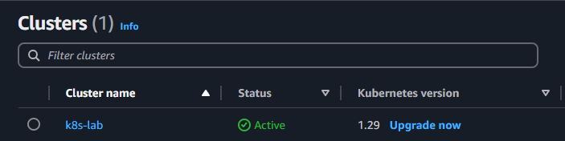

# Terraform Kubernetes Lab

Este laboratorio despliega un clúster de Kubernetes en AWS utilizando Terraform. Se utiliza el módulo oficial `terraform-aws-modules/eks/aws` para facilitar la creación del clúster y sus componentes.

## Estructura del Proyecto

- `main.tf`: definición de los recursos principales (VPC, EKS, Node Groups).
- `provider.tf`: configuración del provider AWS.
- `variables.tf`: declaración de variables necesarias.
- `outputs.tf`: salidas útiles tras el despliegue.

## Requisitos Previos

- Cuenta de AWS activa.
- Perfil de AWS CLI configurado (por ejemplo: `default`).
- Terraform instalado.
- `kubectl` instalado.
- Acceso a Internet.

## Paso a Paso

### Paso 1 - Inicialización del Proyecto

Inicializá el proyecto y descargá los módulos necesarios:

```bash
terraform init
```

### Paso 2 - Modificación de Variables para Abaratar Costos

Editá `variables.tf` y establecé instancias más económicas:

```hcl
variable "node_instance_type" {
  default = "t3.small"
}

variable "desired_size" {
  default = 1
}

variable "min_size" {
  default = 1
}

variable "max_size" {
  default = 2
}
```

### Paso 3 - Planificación y Aplicación

```bash
terraform plan -out eks-plan.tfout
terraform apply "eks-plan.tfout"
```

> ⚠️ Durante el despliegue pueden aparecer advertencias de deprecación sobre `inline_policy`. Se pueden ignorar en este contexto.

### Paso 4 - Verificación desde la Consola de AWS

Accedé a la consola de AWS y verificá:

- El clúster EKS.
- Las instancias EC2 (nodos).
- Los recursos de red (VPC, subredes, gateways).

#### Capturas recomendadas:

- Vista general del clúster.
- Detalle de los nodos EC2.
- Topología de red en VPC.

> 💡 Sugerencia: podés copiar las capturas desde Windows (si usás una VM Linux) y guardarlas en una carpeta `screenshots/` dentro del proyecto para luego versionarlas.

### Paso 5 - Destrucción de Recursos (para evitar costos)

```bash
terraform destroy
```

## Paso 6 - Configuración de `kubectl` (opcional)

Una vez creado el clúster, podés conectarte con:

```bash
aws eks --region us-east-1 update-kubeconfig --name nombre-del-cluster
kubectl get nodes
```

(este paso se realiza luego del despliegue, si no se eliminó el clúster).

## Capturas del laboratorio

A continuación se muestran capturas del entorno desplegado con Terraform:

### 🔹 Estructura de red (VPC)


### 🔹 Subredes creadas en la VPC


### 🔹 Panel de EKS en AWS


### 🔹 Lista de nodos del clúster


```markdown


```

## Módulos Utilizados

- [terraform-aws-modules/eks/aws](https://registry.terraform.io/modules/terraform-aws-modules/eks/aws/latest)
- [terraform-aws-modules/vpc/aws](https://registry.terraform.io/modules/terraform-aws-modules/vpc/aws/latest)

## Autores

Este laboratorio fue realizado como parte de un ejercicio de infraestructura como código para documentar y practicar el despliegue de Kubernetes en AWS utilizando Terraform.
