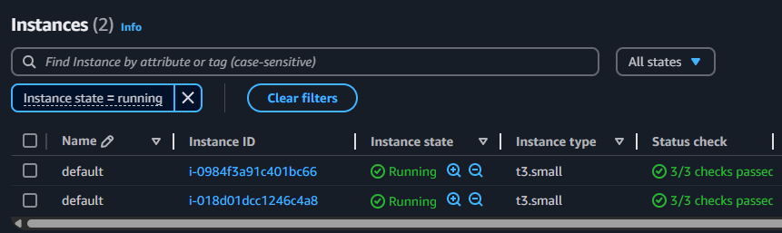

# Laboratorio: Despliegue de EKS en AWS con Terraform

Este proyecto consiste en el despliegue de un clúster de Kubernetes (EKS) en AWS utilizando Terraform. El objetivo fue practicar infraestructura como código, entender cómo se componen los recursos necesarios para levantar un clúster en la nube, y documentar todo el proceso paso a paso.

## Estructura del proyecto

- `main.tf`: definición principal de recursos.
- `provider.tf`: configuración del proveedor AWS.
- `variables.tf`: variables utilizadas para el despliegue.
- `terraform.tfvars`: valores concretos para las variables.
- `outputs.tf`: muestra información útil luego del deploy.
- `docs/`: carpeta con capturas del entorno desplegado.

## Requisitos previos

- Tener instalado Terraform, AWS CLI y `kubectl`.
- Contar con una cuenta de AWS y un perfil configurado en la CLI (por ejemplo, `default`).
- Una clave SSH generada y asociada al repositorio para poder pushear los cambios desde el servidor virtual Linux.

## Paso 1: Inicializar proyecto y definir archivos

Comencé generando los archivos base del proyecto con la configuración inicial de Terraform. Se configuró el proveedor de AWS y se usaron los módulos oficiales de EKS y VPC del Terraform Registry.

### Módulo de VPC

```hcl
module "vpc" {
  source  = "terraform-aws-modules/vpc/aws"
  version = "5.1.2"

  name = "eks-vpc"
  cidr = "10.0.0.0/16"

  azs             = ["us-east-1a", "us-east-1b", "us-east-1c"]
  public_subnets  = ["10.0.1.0/24", "10.0.2.0/24", "10.0.3.0/24"]
  private_subnets = ["10.0.101.0/24", "10.0.102.0/24", "10.0.103.0/24"]

  enable_nat_gateway = true
  single_nat_gateway = true

  tags = {
    Terraform   = "true"
    Environment = "dev"
  }
}

### Módulo de EKS

module "eks" {
  source  = "terraform-aws-modules/eks/aws"
  version = "20.8.4"

  cluster_name    = var.cluster_name
  cluster_version = "1.29"
  subnet_ids      = module.vpc.private_subnets
  vpc_id          = module.vpc.vpc_id

  eks_managed_node_groups = {
    default_node_group = {
      desired_size = 2
      max_size     = 3
      min_size     = 1

      instance_types = ["t3.medium"]
    }
  }

  tags = {
    Terraform   = "true"
    Environment = "dev"
  }
}


### Variables utilizadas

variable "region" {
  description = "Región de AWS"
  default     = "us-east-1"
}

variable "profile" {
  description = "Perfil de AWS CLI"
  default     = "default"
}

variable "cluster_name" {
  description = "Nombre del clúster EKS"
  default     = "k8s-lab"
}

Paso 2: Aplicar Terraform
Con la infraestructura definida, ejecuté los siguientes comandos:

terraform init
terraform plan
terraform apply

Esto desplegó todos los recursos necesarios en AWS: una VPC con subredes públicas y privadas, un NAT Gateway, el clúster EKS y el Node Group.

Paso 3: Resultados
Una vez desplegada la infraestructura, verifiqué desde la consola de AWS que los recursos se habían creado correctamente. A continuación, muestro capturas que evidencian el resultado del laboratorio:

## Capturas del laboratorio

A continuación se muestran capturas del entorno desplegado con Terraform:

### 🔹 Estructura de red (VPC)


### 🔹 Subredes creadas en la VPC


### 🔹 Panel de EKS en AWS


### 🔹 Lista de nodos del clúster


